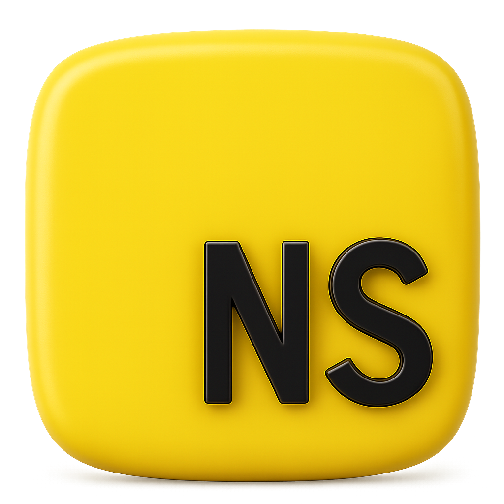

  
  <h1 align="center">NullScript Lang</h1>
  

    Crafting the Future of Programming Languages.
  

  

    <em>Building innovative, high-performance, and community-driven programming languages for the next generation of developers.</em>
  

  

    Hello 👋 and welcome to the official GitHub home of <strong>NullScript Lang</strong>! We are a passionate team dedicated to pushing the boundaries of language design and development.
  

---

## ✨ About NullScript Lang

At **NullScript Lang**, our mission is to empower developers with elegant, efficient, and expressive tools. We believe that the right language can transform how we build software, making complex tasks simpler and unleashing new possibilities.

Our core values drive everything we do:
*   **Innovation**: Continuously exploring new paradigms and optimizing for performance and developer experience.
*   **Openness**: Fostering a transparent and collaborative environment where every contribution is valued.
*   **Quality**: Committing to robust, well-tested, and reliable language implementations.
*   **Community**: Building a vibrant and supportive ecosystem for users and contributors alike.

Our primary goal is to develop the `nullscript` language into a powerful and widely adopted tool, providing a solid foundation for future projects and contributions to the open-source world.

## 🛠️ Our Technologies & Expertise

We specialize in low-level systems programming and language design, leveraging cutting-edge technologies to build highly performant and reliable software.

### Languages

  

### Tools & Ecosystem

  
  
  

## 🚀 Featured Project

We are currently focused on our flagship project:

### 🌐 nullscript

Our groundbreaking new programming language. `nullscript` is designed with a focus on [**_Insert a brief, compelling description here_** - e.g., "unparalleled performance", "simple syntax", "memory safety", "concurrency out-of-the-box", "domain-specific applications"]. We aim to provide a modern, efficient, and enjoyable development experience for systems-level programming and beyond.

**Tech Stack**: Rust

**Explore the Project**:
*   [NullScript](https://github.com/nullscript-lang/nullscript)

*More projects coming soon! Stay tuned!*

## 🤝 Join Our Community & Contribute

We are an open-source organization, and we welcome developers of all skill levels to join us. Whether you're a seasoned language designer, a Rust enthusiast, or new to open source, there's a place for you in the NullScript Lang community!

### How to Get Involved:

1.  **Explore our Repositories**: Dive into `nullscript` and our other projects. Check out the issues for tasks suitable for beginners (`good first issue`) or more advanced challenges.
2.  **Report Bugs & Suggest Features**: Your feedback is invaluable! Open an issue on our repositories if you find a bug or have an idea for an improvement.
3.  **Contribute Code**: Submit pull requests with bug fixes, new features, or documentation improvements. We're happy to guide you through the process.
4.  **Join Discussions**: Participate in discussions, answer questions, and help others in the community.
5.  **Spread the Word**: Share our projects with your network and help us reach more developers!

### Contact & Social

While we currently don't have dedicated social media channels, we encourage you to:

*   **Star our Repositories**: Show your support by starring our projects!
*   **Watch our Repositories**: Stay updated on our latest development.
*   **Open an Issue**: For direct communication regarding projects or ideas, open an issue on the relevant repository.

*Stay tuned for our upcoming community channels (Discord, Twitter, etc.)!*

---

  

    Thanks for visiting <strong>NullScript Lang</strong>! We're excited about the future of programming languages and invite you to be a part of it.
  

  

    <small>Member Since: August 11, 2025</small> | <small>Always open to new ideas and contributions!</small>
  

---
<!-- Note to maintainers: Please replace `assets/logo_light.svg` and `assets/logo_dark.svg` with your actual organization logo paths. -->
